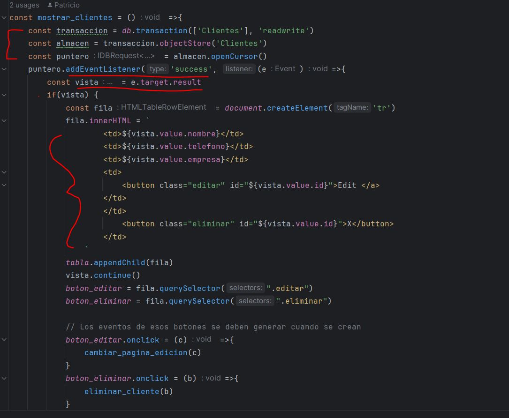
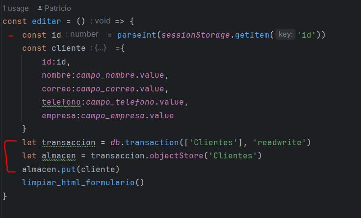
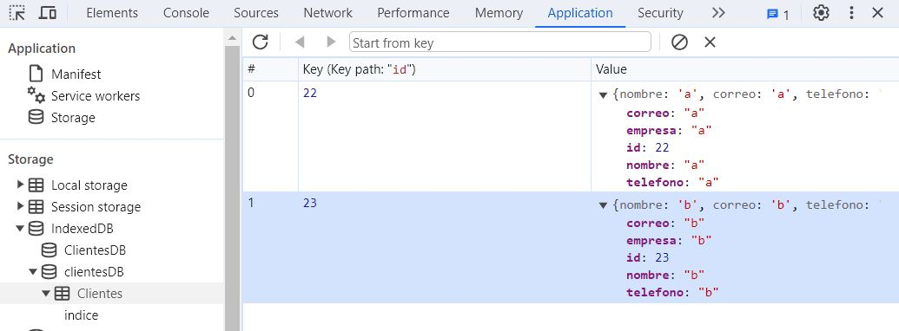

# Guía IndexedDB
##### *Por Patricio Cifredo Reyes*

.jpg)
*Figura 1. Foto de Jeremy Bishop en Unsplash (Licencia Unsplash, uso libre). Extraída de https://unsplash.com/es/fotos/texto-8pc4Z3XEBO8*
* ****
Introducción
=

IndexedDB es una API de bajo nivel que permite almacenar de forma persistente
en el navegador grandes cantidades de datos estructurados. *Webdev(2016)*. Es decir, se trata de una base de 
datos que tienen la mayoría de navegadores y que permite trabajar con datos
en el lado del cliente.

>Sus principales características son:
>* Es una base de datos *NOSQL* transaccional y orientada a objetos
>* Es *asíncrona*: puede trabajar con muchas peticiones simultáneamente
>* Las operaciones se realizan con *transacciones*
>* Se usa el DOM para notificar el resultado de la petición: Los eventos de
 petición con éxito no se propagan (no burbujean) y los de error abortan por defecto
toda transacción
>* Cada Base de datos creada tiene asginado un origen (puerto y dominio), por tanto
no se puede acceder a las Bases de datos desde orígenes diferentes
>* Puede trabajar con mayores volumenes de datos que *LocalStorage*

Conceptos claves
=
Al trabajar con IndexedDB reconocemos los siguientes elementos:

* **IDBDatabase**: Es el objeto que representa la BBDD
* **IDBObjectStore**: El objeto que representa al *almacen*. 
"Sería similar a una tabla dentro de una base de datos relacional." *(Introducción a IndexedDB, 2023)* En el se almacenan
los datos o registros, los cuáles tienen una clave asociada.
* **IDBIndex:** "Interfaz de la API IndexedDB que proporciona acceso asincrónico a un índice en una base 
de datos" *(IDBINDEX - Web APIs | MDN, 2023)*.
* **IDBTransaction**: Objeto que nos permiten el acceso a la lectura y escritura de datos contenidos en la IDBD.
* **IDBRequest**: Permiten realizar las peticiones y consultas. Deben usarse con un evento *onsuccess*
* **IDBCursor**: Objeto que nos permite trabajar con consultas que arrojan multiples resultados.

Funcionamiento
=

###### 1. Iniciar la BBDD
> Aquí podemos observar como necesitamos abrir una petición de acceso a la IDB, dándole un nombre y una versión.
>Para la solicitud marcamos 3 eventos: 
> * **error**: por si hubiese algún fallo
> * **success**: para cuando se logre llevar a cabo
> * **upgradeneeded: para que cree la BBDD la primera vez que se accede a la web**

###### 2. Crear el almacen
> Con **.createObjectStore** generamos el almacen llamado Clientes, cuya clave será *id* que senerará de forma automática
> por autoincremento

###### 3. Guardar en la BBDD
> Para guardar en la IndexedDB debemos seguir los siguientes pasos:
> * Crear una petición y adjuntarle un evento *'onsuccess'*
> * Abrir una transacción con permiso de lectura-escritura
> * Usar esa transacción para utilizar el almacen ObjectStore
> * Añadir a ese almacen el nuevo registro

###### 4. Recuperar datos y mostrarlos
> Para recuperar datos de la IndexedDB debemos:
> * Usar una transacción y el objeto de almacen
> * Abrir un puntero y adjuntarle un evento *'success'*
> * Rescatar los resultados de ese puntero en una *vista*
> * Crear el HTML necesario para su visualización
> * Avanzar al siguiente registro de la vista con *vista.continue()*

###### 5. Editar datos ya existentes en la BBDD
> Para editar:
> * Tenemos que tener la id del registro a actualizar (esta recuperación de la id depende de la implementación que se haya
utilizado expresamente en nuestro programa)
> * Usar una vez más una transacción sobre la BBDD y su correspondiente objeto almacen
> * Usar el método put() para almacen

###### 6. Eliminar datos
> Para eliminar:
> * Tenemos que tener la id del registro a eliminar (esta recuperación de la id depende de la implementación que se haya
    utilizado expresamente en nuestro programa)
> * Usar una vez más una transacción sobre la BBDD y su correspondiente objeto almacen
> * Usar el método delete(id) para almacen

###### 6. Visualización de la BBDD en el navegador

Referencias
=

* Working with IndexedDB. (2016, 1 enero). web.dev. https://web.dev/articles/indexeddb?hl=en
* Introducción a IndexedDB. (2023, 1 noviembre). Manual Web. https://www.manualweb.net/html5/introduccion-indexedDB/
* IndexedDB - referencia de la API Web | MDN. (2023, 19 julio). https://developer.mozilla.org/es/docs/Web/API/IndexedDB_API#browser_compatibility
* IDBINDEX - Web APIs | MDN. (2023, 28 febrero). https://developer.mozilla.org/en-US/docs/Web/API/IDBIndex
* Entendiendo IndexedDB. (s.f.). DesarrolloWeb.com. https://desarrolloweb.com/articulos/indexeddb.html
* Kantor, I. (s. f.). IndexedDB. https://es.javascript.info/indexeddb

